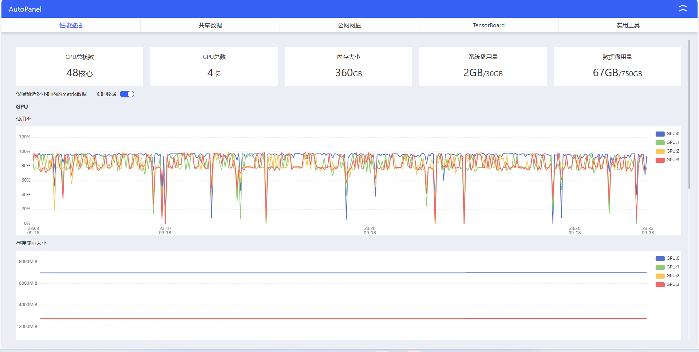

1. [数据集链接](https://drive.google.com/file/d/1gZ43GVNEieHdEHmgCATAfhHmiQvrjM2n/view?usp=share_link)
2. 运行配置
    - 需要280G以上的运行内存
    - 需要150G以上的存储空间
    - 使用4张3080ti需要运行10小时；如果使用1张4090需要运行4小时
3. 环境配置
    - python环境
    - 需要安装torch和simpletransformers等库
    - 需要能够访问外网以拉取相应模型
4. 复现实验的平台配置
